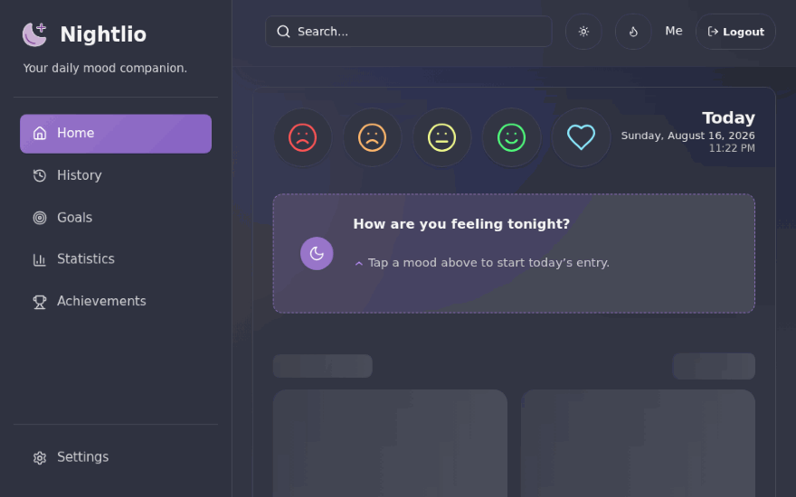
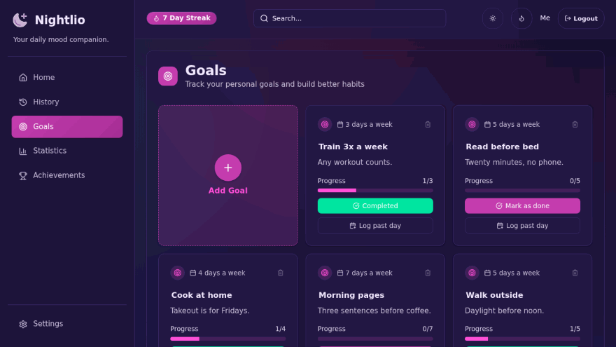
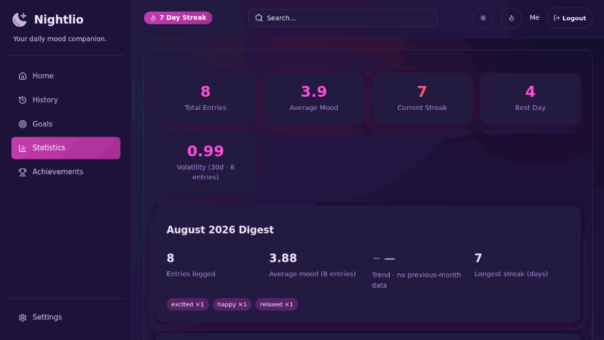
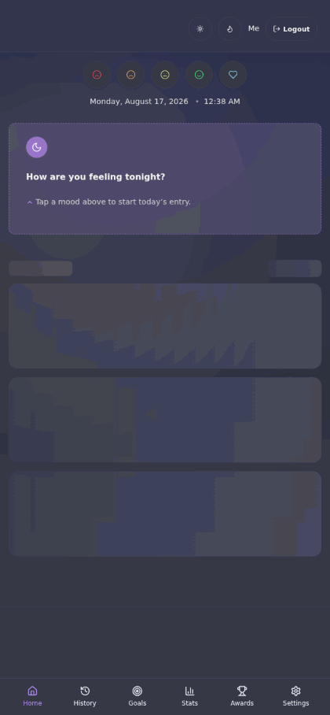
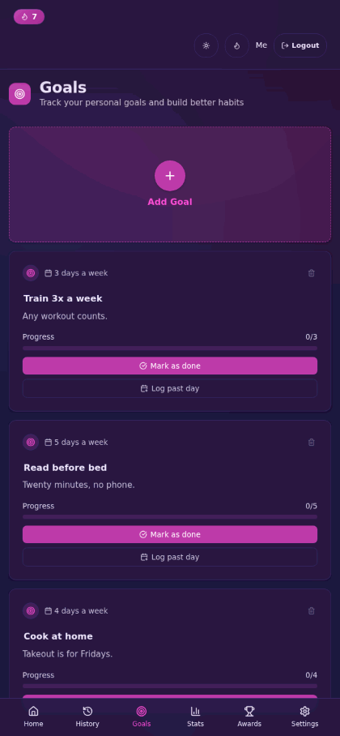
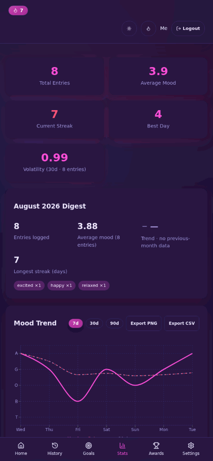

<div align="center">


<h1>Nightlio</h1>

[](LICENSE)
[](https://github.com/FayedPatel/nightlio/actions/workflows/test.yml)

**Privacy-first mood tracker and daily journal, designed for effortless self-hosting.** <br />
**Your data, your server, your rules.**

*A fork of [shirsakm/nightlio](https://github.com/shirsakm/nightlio) — same privacy-first idea, rebuilt on a Rust API and a strict-TypeScript frontend.*

</div>

## Why Nightlio?

Nightlio was inspired by mood-tracking apps like Daylio, but born out of frustration with subscription models, paywalls, and single-device lock-in. It's a feature-complete, open-source alternative you can run anywhere: fully web-based, responsive on desktop and mobile, no ads, no subscriptions, no data mining. Your journal lives in one SQLite file (or, opt-in, your own PostgreSQL database) on *your* server, behind an API that ships as one 158 MB Rust container image and runs in 10–16 MB of RAM in everyday use.

## A tour

Log your day in seconds — pick a mood, write a heading and a few lines (Markdown, autosaved as you type), tag what shaped the day, done:



Weekly goals with streaks and progress, and a completion can be backdated to the day it actually happened:



Analytics that earn their place — calendar heatmap, averages, streaks, tag–mood correlations, rolling averages, day-of-week patterns, volatility:



And the same flows one-handed on a phone, with bottom navigation and an installable PWA:

| New entry | Goals | Statistics |
| --- | --- | --- |
|  |  |  |

## Features

* **Rich journaling with Markdown** — headings, lists, links; autosave while you type; PDF export of any entry.
* **Mood tracking with tags** — a 5-point scale plus customizable tag groups ('Emotions', 'Sleep', 'Productivity', …) to find what moves the needle.
* **Backdating** — file a journal entry or a goal completion under the day it actually happened.
* **Four themes, synced to your account** — Default (Dracula purple), Light, Dark, and Synthwave (the one in the captures above); pick in Settings or cycle from the header.
* **Gamified consistency** — streaks and achievements, counted fairly (viewing statistics counts once per day, not per page load).
* **Single sign-on** — any OIDC-compliant provider; [Pocket ID](https://github.com/pocket-id/pocket-id) (passkeys) ships as an opt-in compose profile. Local passwords and a credential-free single-user mode also supported.
* **Own your data — JSON export & import** — download every entry and goal as one versioned JSON file from Settings → Data, and import it back anywhere (merge, duplicates skipped). Format documented in [docs/EXPORT-FORMAT.md](docs/EXPORT-FORMAT.md).
* **PostgreSQL support (opt-in, experimental)** — point `DATABASE_URL` at your own server and the schema initializes itself; SQLite stays the default. See [docs/POSTGRES.md](docs/POSTGRES.md).
* **Language packs** — English is built in; community language packs are discovered from releases and hot-swap without a redeploy ([docs/I18N.md](docs/I18N.md)).
* **Stable `/api/v1` alias** — a byte-identical versioned prefix for third-party clients.
* **Privacy first, always** — self-hosted, one SQLite file (or your own PostgreSQL), no third-party trackers, no telemetry.
* **Small footprint** — one Rust binary for the API, images published for amd64 + arm64.

## Getting started

One compose command:

```bash
git clone https://github.com/FayedPatel/nightlio.git && cd nightlio
cp .env.docker .env   # set SECRET_KEY and JWT_SECRET
docker compose up -d --build
```

That's the whole install — the app is live at http://localhost:5173/. Full instructions (prebuilt images, public deployment behind a reverse proxy, configuration reference, OIDC single sign-on) live in **[docs/SETUP.md](docs/SETUP.md)**; upgrading an existing instance is covered in **[docs/UPGRADING.md](docs/UPGRADING.md)**.

Just want to poke around first? `docker compose -f docker-compose.demo.yml up --build` boots a throwaway instance on PostgreSQL pre-filled with two weeks of demo data — no `.env` needed.

Contributing or curious how it works? Architecture, local development, the API reference, and the data model are in **[docs/DEVELOPMENT.md](docs/DEVELOPMENT.md)**, and the measured story of the v0.4.0 Rust rewrite is in **[docs/REWRITE.md](docs/REWRITE.md)**.

## Roadmap

- [x] **Responsive Design:** Full support for usage on mobile devices, plus an installable PWA.
- [x] **Multi-User Support:** Multiple accounts on a single instance via local username/password and OIDC (Pocket ID) sign-in.
- [x] **Advanced Analytics:** Tag–mood correlations, rolling averages, day-of-week patterns, and mood volatility.
- [x] **More Themes & Customization:** Four themes (Default, Light, Dark, Synthwave) saved per account.
- [x] **Rust rewrite:** single-binary API, typed contract, 75% smaller images ([details](docs/REWRITE.md)).
- [x] **Data Import/Export:** Versioned JSON export and import of entries and goals from Settings ([format docs](docs/EXPORT-FORMAT.md)). Importing from other services (like Daylio) and CSV export remain future work.

## Security & Privacy

* **Data Ownership:** Your data is stored in a local SQLite file (or your own PostgreSQL database). You can back it up, move it, export it as JSON, or delete it at any time.
* **No Telemetry:** This application does not collect any usage data or send information to third-party services.
* **Secure Authentication:** API endpoints are protected using JSON Web Tokens (JWT); local passwords are stored as argon2id.
* **Configurable CORS:** Restrict API access to trusted domains via environment variables.

See [SECURITY.md](./SECURITY.md) for the full threat model, vulnerability disclosure process, and a record of hardening fixes self-hosters should be aware of when upgrading.

## Credits

Nightlio was created by [shirsakm](https://github.com/shirsakm) — the [original project](https://github.com/shirsakm/nightlio) established everything this fork stands on: the privacy-first, single-SQLite-file journal that's genuinely pleasant to use. This fork is maintained independently and has since diverged (OIDC SSO, themes, backdating, the Rust/TypeScript rewrite), but the idea and the name are upstream's.

## License

This project is licensed under the GNU Affero General Public License v3.0 - see the [LICENSE](LICENSE) file for details.
